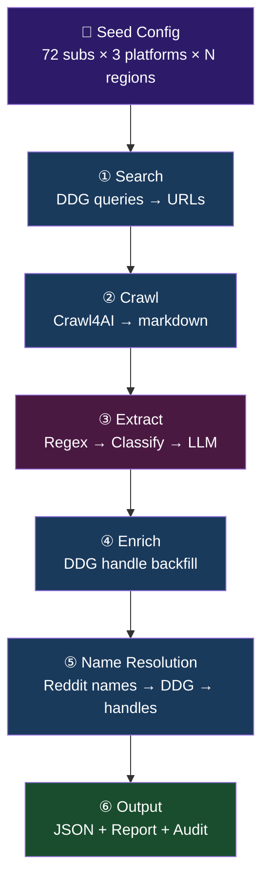
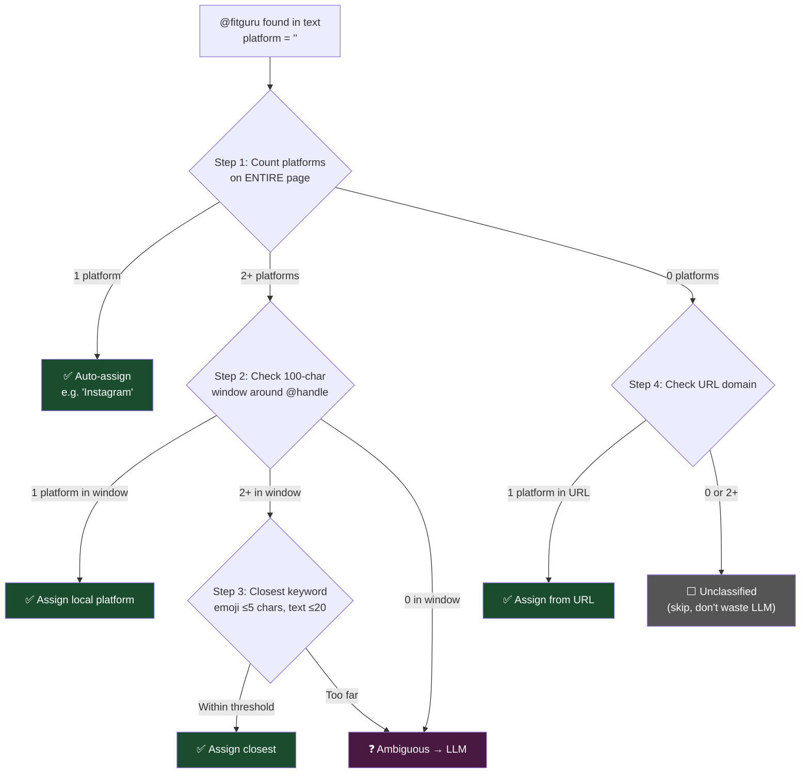
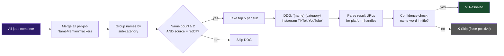

# Seed Crawler — Business Rules Reference

> **Audience**: Developers, code reviewers, and future maintainers.
> **Scope**: Every decision rule the crawler applies from DDG search → final JSON output.
> **Last updated**: 2026-03-15

---

## Table of Contents

1. [Pipeline Overview](#pipeline-overview)
2. [Phase 1 — Search](#phase-1--search)
3. [Phase 2 — Crawl](#phase-2--crawl)
4. [Phase 3 — Extraction](#phase-3--extraction)
   - [3a. Regex Handle Extraction](#3a-regex-handle-extraction)
   - [3b. Naked Handle Classification](#3b-naked-handle-classification)
   - [3c. YouTube Channel Resolution](#3c-youtube-channel-resolution)
   - [3d. Name Mention Tracking](#3d-name-mention-tracking)
   - [3e. LLM Extraction (Conditional)](#3e-llm-extraction-conditional)
5. [Phase 4 — Enrichment](#phase-4--enrichment)
6. [Phase 4½ — Identity Merge & Dedup](#phase-4½--identity-merge--dedup)
7. [Phase 5 — Deferred Name Resolution](#phase-5--deferred-name-resolution)
8. [Phase 6 — Output, Validation, Reporting](#phase-6--output-validation-reporting)
9. [Configuration Reference](#configuration-reference)
10. [Cost Model](#cost-model)
11. [DDG Query Budget](#ddg-query-budget)

---

## Pipeline Overview



### Unit of Work

| Term | Definition | Example |
|------|-----------|---------|
| **Job** | 1 sub × 1 platform × 1 region | `FITNESS/Yoga/Instagram/US` |
| **Sub** | One niche within a category (6 per cat) | Yoga, Calisthenics, Powerlifting |
| **Category** | Top-level grouping (12 total) | FITNESS, BEAUTY, AI, TRAVEL |
| **Full batch** | All subs × all platforms × all regions | 72 × 3 × 2 = 432 jobs |

---

## Phase 1 — Search

**Service**: `SearchService.py` + `QueryBuilder.py`
**Input**: Seed config (sub, platform, region, known_sources, search_prompt, alt_terms)
**Output**: `[(url, query), ...]` + `direct_handles[]`
**Cost**: FREE (DDG)

### Query Types Generated

For each job, `QueryBuilder` generates queries in this order:

| # | Type | Template | Count |
|---|------|----------|-------|
| 1 | Primary open | `"{sub}" {search_prompt} {platform} influencers list {year}` | 1 |
| 2 | Alt open | `"{sub}" {alt_term} {platform} influencers {region} {year}` | len(alt_terms) |
| 3 | Site-targeted | `site:{source} {search_prompt} {platform} {year}` | len(known_sources) |

> For non-Easy subcategories, all queries are prefixed with an `inurl:` OR clause
> derived from the sub-category name to constrain results to relevant URL paths.

**Example** for `FITNESS/Yoga/Instagram/US` with 2 known sources and 3 alt terms:
```
# Primary open (1 query)
"Yoga" top yoga influencers Instagram influencers list 2026

# Alt open (3 queries)
"Yoga" yoga teachers Instagram influencers US 2026
"Yoga" hot yoga creators Instagram influencers US 2026
"Yoga" vinyasa flow accounts Instagram influencers US 2026

# Site-targeted (2 queries)
site:favikon.com top yoga influencers Instagram 2026
site:modash.io top yoga influencers Instagram 2026
```

Total = 1 + 3 + 2 = **6 queries** for this job.

### Decision Rules

| Rule | Details |
|------|---------|
| **Ad filtering** | URLs from `bing.com`, `microsoft.com`, `googleadservices.com` → rejected |
| **DDG dorking** | If DDG returns `instagram.com/handle`, `tiktok.com/@handle`, etc. → extract handle immediately, skip crawling that URL |
| **URL cap** | Max `MAX_URLS_PER_JOB` (120) unique URLs per job |
| **Rate limiting** | `SEARCH_DELAY_SECONDS` (2s) pause between queries |
| **Retry** | Exponential backoff: `2^attempt + jitter`, max 30s, up to 3 retries |
| **Caching** | `SearchCache` stores results on disk; cache hit = skip DDG |
| **Engine rotation** | `SEARCH_BACKEND="auto"` rotates across DDG, Brave, Bing, Google, etc. |
| **Circuit breaker (per-config)** | If ≥50% of queries for a config fail (`DDG_FAILURE_THRESHOLD_PCT`), skip crawl/extract for that config. Only evaluated after `DDG_FAILURE_MIN_QUERIES` (3) queries. |
| **Circuit breaker (global)** | If `DDG_KILL_AFTER_N` (3) consecutive configs produce errored outcomes, stop all remaining search. Remaining configs are marked as `ErroredConfig`. |

---

## Phase 2 — Crawl

**Service**: `CrawlService.py`
**Input**: `[(url, query), ...]`
**Output**: `PageResult[]` (url, raw_markdown, fit_markdown, token estimates)
**Cost**: FREE (Crawl4AI, headless Chrome)

### Decision Rules

| Rule | Details |
|------|---------|
| **Browser** | Headless Chrome via Playwright |
| **Concurrency** | `CRAWL_CONCURRENCY` = 5 simultaneous browsers |
| **BFS** | If `--no-bfs`, crawl given URLs only. Otherwise follow links 1 level deep, max 20 extra pages |
| **Excluded tags** | `nav`, `footer`, `header`, `aside` stripped before markdown |
| **Pruning** | `PruningContentFilter(threshold=0.48)` removes low-info blocks |
| **Word threshold** | Blocks with <10 words removed |
| **Token savings** | `raw_markdown` → `fit_markdown` typically 20-60% reduction |
| **Output** | Fit markdown saved to `results/pages/{domain}_{path}.md` |

---

## Phase 3 — Extraction

This is the most complex phase with 5 sub-steps running in sequence.

### 3a. Regex Handle Extraction

**Service**: `RegexHandleExtractor.py`
**Cost**: FREE

Scans `raw_markdown` (not fit_markdown — richer context) for social media handles.

#### Extraction Priority (highest → lowest)


| # | Pattern | Platform | Confidence | Example Match |
|---|---------|----------|------------|---------------|
| 1 | `A post shared by Name (@handle)` | Instagram | 🟢 High + name | `A post shared by Joe Wicks (@joewicks)` |
| 2 | `instagram.com/{handle}` | Instagram | 🟢 High | `instagram.com/kayla_itsines` |
| 3 | `instagr.am/{handle}` | Instagram | 🟢 High | `instagr.am/joewicks` |
| 4 | `tiktok.com/@{handle}` | TikTok | 🟢 High | `tiktok.com/@charlidamelio` |
| 5 | `youtube.com/@{handle}` | YouTube | 🟢 High | `youtube.com/@MrBeast` |
| 6 | `youtube.com/c/{handle}` | YouTube | 🟢 High | `youtube.com/c/AthleanX` |
| 7 | `youtube.com/user/{handle}` | YouTube | 🟢 High | `youtube.com/user/JeffNippard` |
| 8 | `youtube.com/channel/UC...` | YouTube | 🟡 Medium (needs resolution) | `youtube.com/channel/UCe0TLA0EsQbE-MjuHXevj2A` |
| 9 | `x.com/{handle}` / `twitter.com/{handle}` | Twitter | 🟢 High | `x.com/elonmusk` |
| 10 | `@{handle}` in plain text | ❓ Unknown | 🔴 Low (no platform) | `Follow @fitguru` |

> **X/Twitter note:** Twitter handles are extracted and stored but Twitter is **not** one of
> the three output platform columns (`ig_handle`, `tk_handle`, `yt_handle`). Twitter handles
> inform identity merge but don't produce a seed column.

#### Handle Validation (`_is_valid_handle`)

Every extracted handle must pass these checks:

```
✅ PASS conditions:
   - ≥ 2 characters long
   - Not in _IGNORE_HANDLES (200+ entries)
   - No prefix match (utm_, ig_, ref=, img_)
   - Not pure numeric (post IDs)
   - No consecutive dots (..)
   - No domain suffixes (.com, .co.uk, etc.)  
   - No .com mid-string (email fragments)

❌ BLOCKED categories (200+ entries):
   - URL path segments: p, reel, stories, explore, foryou, watch...
   - CSS/JSON-LD: @context, @type, @media, @font, @keyframes...
   - Tailwind breakpoints: @sm, @md, @lg, @xl, @2xl...  
   - JS frameworks: @vue, @babel, @react, @angular, @svelte...
   - Template placeholders: @username, @handle, @example...
   - Platform accounts: @instagram, @tiktok, @youtube...
   - Aggregator accounts: @feedspot, @modash, @favikon...
   - Major brands: @nike, @adidas, @gucci, @apple, @google...
   - Media/news: @forbes, @bbc, @cnn, @espn...
   - Sports orgs: @nba, @nfl, @ufc, @fifa...
   - Country/city names: @usa, @london, @tokyo...
   - Profanity substrings: handles containing vulgar terms are rejected
     via `_IGNORE_SUBSTRINGS` (substring match, not exact)
```

#### Name Assignment from Headings

For listicle pages (Modash, JoliApp, Feedspot) where handles appear under headings like `### Sabiha Divan`:

```
Rule: If handle has no name AND nearest preceding heading is:
  - Within 500 characters above the handle
  - 1-5 words, primarily alphabetic
  - At least one capitalized word
  - NOT in the heading blocklist (top X, best X, influencer, etc.)
→ Assign heading text as the handle's name
```

---

### 3b. Naked Handle Classification

**Service**: `PlatformClassifier.py` + `HandleClassifier.py`
**When**: Regex finds `@handle` with no URL context (platform = "")

This is a **5-step cascade** — each step either assigns a platform, declares ambiguous (→ LLM), or leaves unclassified:



**Platform keywords matched**:
| Platform | Keywords | Emoji |
|----------|----------|-------|
| Instagram | `instagram`, `insta`, `IG` | 📸 |
| TikTok | `tiktok`, `tik tok` | 🎵 |
| YouTube | `youtube`, `you tube`, `YT` | 📺 🎥 |

**LLM fallback** (HandleClassifier) fires ONLY when all 3 conditions are true:
1. 2+ platforms on page (ambiguous context)
2. Zero URL-tagged handles on page (no URL-extracted handles with platform)
3. Naked handles remain after mechanical classification

> If the page already has URL-tagged handles → discard ambiguous naked handles (they're likely brand mentions / sponsors).

**Example**:
```
Page text: "Top Instagram creators: ... check @fitguru on TikTok too"
                                        ↑
                                  100-char window
                                  
Step 1: Page has Instagram + TikTok → 2 platforms
Step 2: Window around @fitguru → both Instagram AND TikTok keywords → 2+
Step 3: "TikTok" is 12 chars from @fitguru, "Instagram" is 45 chars away
        → TikTok wins (closest ≤20 chars) → assign @fitguru = TikTok
```

---

### 3c. YouTube Channel Resolution

**Service**: `YouTubeChannelResolver.py`
**When**: Regex finds `youtube.com/channel/UC{22-26 chars}`
**Cost**: 1 HTTP request per channel ID (no LLM)

Channel IDs (`UCe0TLA0EsQbE-MjuHXevj2A`) need an HTTP request to resolve the `@handle`.

#### Resolution Cascade

```
┌──────────────────────────────────────────────────────────────────┐
│ 1. GET https://youtube.com/channel/UC{id}                       │
│    (with SOCS consent cookie to bypass EU consent page)          │
│                                                                  │
│ 2. Check final URL after redirects                               │
│    → "youtube.com/@TheBodyCoach" → handle = "TheBodyCoach"       │
│                                                                  │
│ 3. Check <link rel="canonical"> in HTML head                     │
│                                                                  │
│ 4. Check "canonicalBaseUrl":"/@handle" in JS data                │
│                                                                  │
│ 5. Check "vanityChannelUrl":"youtube.com/@handle" in JS          │
└──────────────────────────────────────────────────────────────────┘
```

**Example:**
```
Input:  youtube.com/channel/UC4qk9TtGhBKCkoWz5qGJcGg
Step 1: GET → 302 redirect → youtube.com/@TheBodyCoach
Result: handle = "TheBodyCoach"
```

**Config:** Concurrency 3 simultaneous HTTP requests. Retry: exponential backoff (2s, 4s, 8s), max 3 retries. Consent cookie: `SOCS` bypass for EU.

Resolved handles are added as YouTube Influencer entries.

---

### 3d. Name Mention Tracking

**Service**: `NameExtractor.py` + `NameMentionTracker.py`
**When**: Every crawled page (Reddit and non-Reddit)
**Cost**: FREE

Extracts candidate influencer **names** (not handles) from text — targets Reddit-style pages where influencers are mentioned by name ("Alex Leonidas", "Jeff Nippard").

#### Name Extraction Rules

```
Regex: 2-3 consecutive capitalized words
       [A-Z][a-zA-Z'-]+(\s[A-Z][a-zA-Z'-]+){1,2}

Filters (must pass ALL):
  ✅ 4+ characters total
  ✅ Not in name blocklist (countries, Reddit UI, generic phrases)
  ✅ First word not a sentence starter (Also, Plus, And, But, This, etc.)
  ✅ No possessive suffix stripped (Jonathan Warren's → Jonathan Warren)
  
Max: 50 names per page (safety valve)
```

#### Tracker Behavior

Each name is recorded with:
- **count**: occurrences on this page
- **source_type**: `"reddit"` or `"non-reddit"` (based on URL)
- **sub_name**: which sub-category this page belongs to

Names are **fuzzy-grouped** (difflib SequenceMatcher ≥ 90% ratio). "Jeff Nippard" and "Jeff Nipard" merge into one bucket.

---

### 3e. LLM Extraction (Conditional)

**Service**: `LLMExtractionService.py`
**Model**: Gemini 2.5 Flash Lite (`gemini/gemini-2.5-flash-lite`)
**Cost**: ~$0.0003/page

#### When LLM Fires

```
LLM fires ONLY when BOTH conditions are true:
  1. Page has ZERO handles (URL-tagged + naked combined)
  2. Page URL contains a listicle keyword:
     influencer|creator|blogger|vlogger|youtuber|instagrammer|
     top\d+|best\d+|list|roundup|follow

Naked @handles do NOT trigger LLM — they are classified
via the mechanical cascade above.
```

**Example decisions**:
```
Page: modash.io/blog/fitness-influencers
  URL handles: 15   Naked: 3   → LLM: ❌ (has handles)

Page: reddit.com/r/fitness/comments/best-trainers
  URL handles: 0    Naked: 0   → LLM: ❌ (no listicle keyword match)

Page: favikon.com/blog/top-10-yoga-influencers  
  URL handles: 0    Naked: 0   → LLM: ✅ (zero handles + listicle URL)
```

#### LLM Output Parsing

`ResponseParser` handles 3 JSON shapes:
```json
// Shape 1: Standard
{"influencers": [{"name": "Joe Wicks", "handle": "joewicks"}]}

// Shape 2: Chunked (multiple objects)
[{"influencers": [...]}, {"influencers": [...]}]

// Shape 3: Flat array
[{"name": "Joe Wicks", "handle": "joewicks"}]
```

#### Merge Priority

When combining all extraction sources, priority is:

```
LLM handles > DDG direct handles > NameCleaner-validated regex handles
```

Dedup key: `(handle.lower(), platform.lower())`

---

## Phase 4 — Enrichment

**Service**: `NameToHandleService.py`
**Cost**: FREE (DDG)

### Handle Backfill

For influencers with a name but missing a handle on the target platform:

```
DDG query: "{name}" {platform_domain}
   e.g. → "Jeff Nippard" instagram.com

Parse results:
  1. URL match: instagram.com/{handle} → extract   
  2. Text match: @{handle} in title/body → extract
  
Junk path filter per platform:
  Instagram: /explore, /accounts, /developer, /reel...
  TikTok: /foryou, /following, /discover...
  YouTube: /watch, /playlist, /shorts, /feed...
```

#### Cross-Platform Qualification Rules

| Rule | Value | Rationale |
|------|-------|-----------|
| Must have ≥1 handle | Required | Name-only → deferred to name resolution |
| Must need target platform | Required | Already has IG → skip |
| Min source citations | ≥ 2 pages | Multi-cited = more likely real |
| Max lookups per job | 5 | Caps DDG budget |
| Sort order | Most-cited first | Best ROI |

#### Cross-Platform Logic

| Scenario | `--no-cross-platform-lookup` OFF | `--no-cross-platform-lookup` ON |
|----------|---------------------------|--|
| Name only, no handles | DDG lookup ✅ | DDG lookup ✅ |
| Has TikTok, needs Instagram | DDG lookup ✅ | Skip ❌ |
| Has all platforms | Skip ❌ | Skip ❌ |

### Per-Job Deduplication

```
Key = (handle.lower().lstrip("@"), platform.value.lower())
If no handle: key = ("", name.lower())

First occurrence wins.
Duplicates: source_urls unioned, handles merged into surviving entry.
```

---

## Phase 4½ — Identity Merge & Dedup

**Service**: `InfluencerMerger.py`
**When**: After enrichment, before final output
**Cost**: FREE (pure computation)

### Handle Normalization

```
raw                    → strip @,_,.  → strip affixes
"@_deliciouslyella"    → "deliciouslyella" → "deliciouslyella"
"the.real.gordon"      → "therealgordon"   → "gordon"
"official_mrbeast"     → "officialmrbeast" → "mrbeast"
```

**Steps:**
1. Lowercase
2. Strip leading `@`
3. Remove all `_` and `.`
4. Strip common affixes (2 passes): `the`, `real`, `official`, `iam`, `itsme`,
   `mr`, `mrs`, `dr`, `dj`, `mc`, `tv`, `hq`, `page`

### Merge Rules

| Case | Rule |
|------|------|
| Same normalized handle | → same person |
| Same name (lowered) AND name ≠ handle | → same person |
| Handle has dots matching a name | `rena.awada` merges with `Rena Awada` |

### Name Selection

```
Priority: Real name (≠ handle) > longest name > first seen
```

### Minimum Handle Length

Handles < 3 chars after normalization → dropped (extraction noise).

### to_seeds() — DB Conversion

```python
SeedInfluencer(
    name="Kayla Itsines",
    ig_handle="kayla_itsines",
    tk_handle="kayla_itsines",
    yt_handle="",
    categories=["FITNESS"],
)
```

Global dedup key: `(handle_lower, platform_lower)`.

---

## Phase 5 — Deferred Name Resolution

**Service**: `NameResolver.py` + `NameMentionTracker.py`
**When**: After ALL jobs complete (pipeline-level, not per-job)
**Cost**: FREE (DDG) but rate-limited
**Default**: **OFF** (enable with `--name-resolution`)

### Flow



### Decision Rules

| Rule | Details |
|------|---------|
| **Feature flag** | `--name-resolution` (off by default) |
| **Min mentions** | `--name-min-mentions` (default: 2) — name must appear ≥N times across all pages |
| **Reddit-only** | Only names from Reddit-sourced pages qualify for resolution |
| **Top 5 per sub** | Within each sub-category, only top 5 names by count are resolved |
| **Max DDG calls** | `numSubs × 5` = 72 × 5 = **360** (worst case full batch) |
| **Confidence check** | At least one word from the candidate name must appear in DDG result title |
| **Zero-result retry** | Up to 4 retries with fresh DDG instance when zero platform URLs found |
| **Name grouping** | Fuzzy-matched names (≥90% similarity) merge: "Jeff Nippard" + "Jeff Nipard" = 1 bucket |

**Example**:
```
Sub: Fitness
Names after all jobs:
  Jeff Nippard    — 7 mentions (reddit) ← Rank #1 → RESOLVE
  Alex Leonidas   — 4 mentions (reddit) ← Rank #2 → RESOLVE  
  Sean Nalewanyj  — 3 mentions (reddit) ← Rank #3 → RESOLVE
  Random Guru     — 1 mention (reddit)  ← Below threshold → SKIP
  Blog Author     — 5 mentions (non-reddit) ← Not reddit → SKIP

DDG for "Jeff Nippard":
  Query: "Jeff Nippard Fitness Instagram TikTok YouTube"
  Result: instagram.com/jeffnippard (title: "Jeff Nippard (@jeffnippard)")
  → "Jeff" in title? ✅ → resolved: @jeffnippard (Instagram)
```

---

## Phase 6 — Output, Validation, Reporting

### Output Schema

```json
{
  "regions": [{
    "region": "US",
    "platforms": {
      "Instagram": {
        "FITNESS": {
          "Yoga": {
            "is_top_level": false,
            "sources": [{"url": "...", "query": "...", "influencers": [...]}],
            "all_influencers": [{"name": "...", "handles": {"Instagram": "..."}}]
          }
        }
      }
    }
  }],
  "name_mentions": [{
    "canonical": "Jeff Nippard",
    "variants": ["Jeff Nippard", "Jeff Nipard"],
    "mention_count": 7,
    "source_types": ["reddit"],
    "sub_names": ["Fitness", "CrossFit"],
    "was_searched": true,
    "resolved_handle": "jeffnippard",
    "resolved_platform": "Instagram"
  }]
}
```

### Canary Validation

328 known SM-native influencers in `canary_influencers.json`:
```json
{"FITNESS": {"Yoga": {"US": ["Adriene Mishler", "Patrick Beach"]}}}
```

Per job: compare canaries vs results → pass rate = regression detector.

### Audit Trail

Every decision logged to `results/audit/{job_key}.jsonl`:
```
search   → url_accepted, url_rejected, direct_handle, cache_hit, retry
crawl    → page_success, page_failed
extract  → llm_call (tokens, count)
enrich   → handle_found, dedup, retry, permanent_failure
name_res → resolved, no_match
```

---

## Configuration Reference

| Constant | Default | CLI Override | Description |
|----------|---------|-------------|-------------|
| `SEARCH_DELAY_SECONDS` | 2 | — | Pause between DDG queries |
| `MAX_SEARCH_RESULTS` | 5 | — | Max results per query |
| `SEARCH_BACKEND` | `"auto"` | — | Engine rotation: auto, duckduckgo, brave, bing, google |
| `SEARCH_REGION` | `"us-en"` | — | DDG region code |
| `MAX_URLS_PER_JOB` | 120 | — | Hard cap on unique URLs per job |
| `CRAWL_CONCURRENCY` | 5 | — | Max concurrent browser instances |
| `BFS_MAX_DEPTH` | 1 | `--no-bfs` | 0=no BFS, 1=follow one level |
| `BFS_MAX_PAGES` | 20 | — | Max extra pages per BFS pass |
| `LLM_PROVIDER` | `gemini/gemini-2.5-flash-lite` | — | LiteLLM model identifier |
| `LLM_DELAY_SECONDS` | 2 (0 for Ollama) | — | Pause between LLM calls |
| `ENRICH_DELAY_SECONDS` | 1 | — | Pause between DDG enrichment queries |
| `MAX_RETRIES` | 3 | — | Max retry attempts (DDG + LLM) |
| `BACKOFF_BASE_SECONDS` | 2 | — | Exponential backoff base |
| `BACKOFF_MAX_SECONDS` | 30 | — | Backoff cap |
| `PRUNING_THRESHOLD` | 0.48 | — | Content filter aggressiveness |
| `WORD_COUNT_THRESHOLD` | 10 | — | Min words per text block |
| `NAME_RESOLUTION_ENABLED` | `False` | `--name-resolution` | Enable deferred name→handle resolution |
| `NAME_RESOLUTION_MIN_MENTIONS` | 2 | `--name-min-mentions` | Min cross-page mentions for DDG |
| `NAME_RESOLUTION_MAX_PER_SUB` | 5 | — | Max names resolved per sub-category |
| `DDG_FAILURE_THRESHOLD_PCT` | 0.5 | — | Abort config if ≥50% queries fail permanently |
| `DDG_FAILURE_MIN_QUERIES` | 3 | — | Don't evaluate failure threshold until N queries attempted |
| `DDG_KILL_AFTER_N` | 3 | — | Kill all remaining search after N consecutive config failures |

### CLI Flags

```bash
# Required (mutually exclusive)
--job FITNESS/Yoga/Instagram/US     # Single job
--category FITNESS                  # All jobs for a category
--all                               # All 432 jobs
--url https://example.com           # Single URL override

# Optional
--sample 3                          # Only N pages to LLM
--no-bfs                            # Disable BFS link-following
--no-cross-platform-lookup          # Skip DDG for cross-platform handles
--region US                         # Filter by region
--phase                             # Use phase pipeline (search all → dedupe → crawl once)
--name-resolution                   # Enable deferred name → handle resolution
--name-min-mentions 2               # Min mentions for name resolution
--platform Instagram                # Platform context for --url mode
```

---

## Cost Model

| Component | Cost | What Triggers It |
|-----------|------|-----------------|
| DDG search queries | **Free** | Always runs |
| Crawl4AI (Chrome) | **Free** | Always runs |
| Regex extraction | **Free** | Always runs |
| Mechanical classification | **Free** | When naked @handles found |
| HandleClassifier LLM | **~$0.001/batch** | When 2+ platforms + 0 URL-handles + ambiguous naked handles |
| ExtractionService LLM | **~$0.0003/page** | When zero handles + listicle URL |
| DDG enrichment | **Free** | Name-only influencers needing handle backfill |
| DDG name resolution | **Free** | When `--name-resolution` enabled, names above threshold |

### Typical Cost Per Job

```
~30 pages × ~2 LLM pages (most have regex handles) = ~$0.001
+ 1 HandleClassifier batch (if needed) = ~$0.001
≈ $0.002 per job

Full batch (432 jobs): ~$0.86
```

---

## DDG Query Budget

### Search Phase (per job)

```
queries_per_job = 1                           # primary open
                + len(altSearchTerms)         # alt open
                + len(knownSources)           # site-targeted

Typical: 1 + 3 + 2 = 6 queries/job
```

### Full Batch Totals

| Phase | Formula | 2 regions | 3 regions |
|-------|---------|-----------|-----------|
| **Search** | numSubs × numPlatforms × numRegions × queriesPerJob | 72 × 3 × 2 × ~6 = **2,592** | 72 × 3 × 3 × ~6 = **3,888** |
| **Enrichment** | Variable (per name-only influencer) | ~200-500 | ~300-750 |
| **Name Resolution** | numSubs × maxPerSub × numRegions | 72 × 5 × 2 = **720** | 72 × 5 × 3 = **1,080** |
| **Total** | — | **~3,512** | **~5,718** |

> [!IMPORTANT]
> Name resolution DDG calls **multiply by region** when regions run as separate parallel
> streams (each `--region X` invocation has its own tracker). If you batch all regions in
> a single pipeline run, names merge across regions and the cap is `numSubs × 5`.
>
> | Execution mode | Name resolution DDG |
> |---|---|
> | `--region US` + `--region UK` (parallel) | 72 × 5 × 2 = **720** |
> | `--all` (single batch, names merge) | 72 × 5 = **360** |
